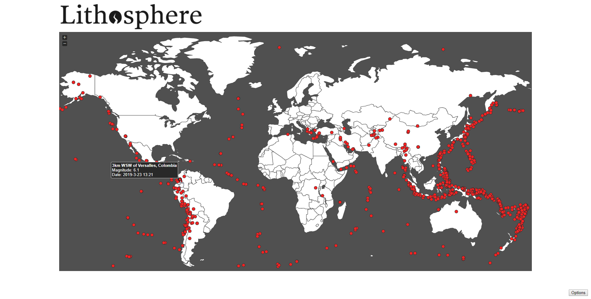

# lithosphere

Shows earthquakes on a world map, which are filterable by date and magnitude ranges. Earthquake data is from earthquake.usgs.gov, and includes all recorded mangnitude 5.0+ earthquakes from 2000/01/01 to 2019/09/07.

Built with NodeJS, SQLite, jQuery, [ion.rangeSlider](https://github.com/IonDen/ion.rangeSlider), and [jVectorMap](http://jvectormap.com/).

